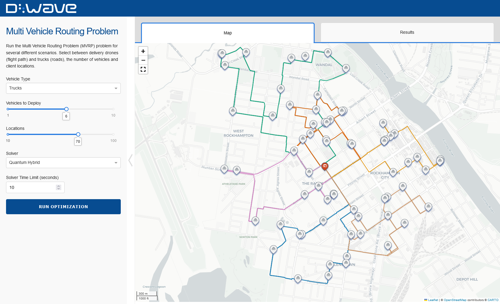

[](https://codespaces.new/dwave-examples/mvrp?quickstart=1)

# Multi Vehicle Routing Problem

Run the Multi Vehicle Routing Problem (MVRP) problem for several different
scenarios. Select between delivery drones (flight path) and trucks (roads), the
number of vehicles and client locations.



## Installation

You can run this example without installation in cloud-based IDEs that support
the [Development Containers specification](https://containers.dev/supporting)
(aka "devcontainers").

For development environments that do not support `devcontainers`, install
requirements:

```bash
pip install -r requirements.txt
```

If you are cloning the repo to your local system, working in a
[virtual environment](https://docs.python.org/3/library/venv.html) is
recommended.

## Usage

Your development environment should be configured to
[access Leap’s Solvers](https://docs.dwavequantum.com/en/latest/ocean/leap_authorization.html).
You can see information about supported IDEs and authorizing access to your Leap
account [here](https://docs.dwavequantum.com/en/latest/leap_sapi/dev_env.html).

To run the demo:

```bash
python app.py
```

Access the user interface with your browser at http://127.0.0.1:8050/.

The demo program opens an interface where you can configure problems and submit
these problems to a solver.

Configuration options can be found in the [app_configs.py](app_configs.py) file.

## Problem Description

The multi-vehicle routing problem is to deliver a set of resources to a set of
predetermined locations using a limited number of vehicles, all of which start
and finish at a single depot location.

This problem can be seen as a generalized traveling salespersons problem (TSP)
where each vehicle must traverse a local network of locations in the most
effective way, while also optimizing the distribution of sets of locations among
the vehicles.

In this demo a single central depot location is determined by choosing an
address (can be set in [app_configs.py](app_configs.py)), after which a number
of locations are placed randomly within a specified radius of the depot. The
vehicles can either be trucks, following the road network, or drones, traversing
the map as the crow flies. The problem can then be solved using either a
classical or a quantum hybrid solver for a chosen number of vehicles and
locations.

## License

Released under the Apache License 2.0. See [LICENSE](LICENSE) file.